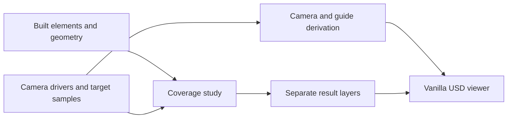

# Camera coverage as a derivation over the built thing

## 1 The problem

Security designers need to show which entrances can be observed at a stated image density and which private areas must remain outside camera views. A drawn cone cannot answer either question when walls, equipment or trays obstruct a sightline. Rechecking after a design edit needs repeatable calculations tied to the same element identities.

## 2 The data as it arrives

IFC camera properties and COBie Component/Type/Attribute rows mix device placement, catalogue optics and occurrence overrides. Some exports also contain decorative field-of-view geometry. The importer joins on core `aeco:id`, promotes recognised facts and blocks only their redundant quarantined copies. Unknown evidence survives. The unit-explicit `Pset_AecoCctv` JSON contract takes precedence over a less expressive standard mirror.

The published demo stage carries those properties already under `aeco:props:`. Its USD input reader feeds the existing importer without invoking a facility generator or IFC converter. A source USD stage has no surviving IFC measure-type metadata for every legacy mirror: the tier A JSON remains authoritative; mirror conflicts are recorded in the transient import log.

## 3 The model in USD

One core element is the device. Camera-typed children carry SensorAPI and inherited optics; they have no second element identity. PresetAPI instances express discrete motorised positions. A Scope with StudyAPI uses native collections for cameras, targets and exclusions. CoverageAPI decorates result Scopes beneath that study. The system remains an AecoSystem with its native members collection.

Editors author drivers. Derivation writes native Camera properties, guide meshes, shells and tours into separate layers. Derived gprims carry the core representation mark; geometry stays outside the core schema namespace. Removing CCTV layers preserves core identity, placement and classification. No new typed referent or kind token is introduced.

## 4 Workflow

1. Supply a core stage and camera evidence: `aeco-cctv import core.usda cameras.ifc -o kind.usda`, or `aeco-cctv import published.usda -o kind.usda` for quarantined USD.
2. Author provider/target/exclusion collections and optical, pose and sampling drivers.
3. Run `aeco-cctv derive kind.usda -o derived.usda`.
4. Run `aeco-cctv study studies.usda /SecurityStudies/CriticalDoors -o doors.usda`.
5. Review findings and blocker identities, edit drivers, and derive again. A changed input hash makes retained study results stale.

Run the complete pinned workflow with `python examples/datacentre/run.py` using the environment in the root README. Add `--publish` only to update committed images and their manifest; expected findings are reviewed separately.

## 5 Validation

The Python plugin registers 23 rules under `UsdAecoCctvValidators`. Qualified names are `usdAecoCctvValidators:Cctv…Checker`. Legacy `cctv…` error codes and severity profiles remain stable. Validators read derived results; they do not silently run a study.

| Rule suffix | Default severity and condition |
|---|---|
| `CctvInvalidSamplingChecker` | Error: sample grid/fraction drivers are invalid. |
| `CctvMissingOpticsChecker` | Error: a sensor has no source optics evidence. |
| `CctvUnsupportedTopologyChecker` | Error: a mesh has unsupported or malformed topology. |
| `CctvKindMismatchChecker` | Warn: camera API classification must be IfcAudioVisualAppliance or a registered camera class. |
| `CctvSensorMissingChecker` | Error: a camera element needs a Camera child wearing AecoCctvSensorAPI. |
| `CctvSensorOrphanChecker` | Warn: sensor API on a Camera whose parent is not a camera element. |
| `CctvOutOfEnvelopeChecker` | Error: pan, tilt or focal length (presets included) outside the sensor's ranges. |
| `CctvNativeCameraAuthoredChecker` | Warn: stock camera attributes or xformOps authored on a sensor outside the derived layer. |
| `CctvDerivedMismatchChecker` | Warn: derived hfov/vfov/effectiveWidth disagree with a recomputation from the drivers. |
| `CctvMountFrameChecker` | Warn: downward mount tilted upward, or mount height outside a study's mountHeightRange. |
| `CctvSystemCapacityChecker` | Warn: camera members of a system exceed its recorderCapacity. |
| `CctvUnsupportedProjectionChecker` | Error: an included study sensor is not rectilinear. |
| `CctvStudyIncompleteChecker` | Warn: result set is missing, duplicated or invalid. |
| `CctvUnphasedProviderChecker` | Warn: an included camera or target has no authored phase. |
| `CctvStudyMissingResultsChecker` | Info: the study has never been run. |
| `CctvStudyStaleChecker` | Warn: the study's inputHash differs from the current inputs. |
| `CctvTargetUncoveredChecker` | Error: no view covers the target at its requirement; names the blockers. |
| `CctvTargetMostlyEnclosedChecker` | Warn: more than half the target samples are enclosed; redefine the region. |
| `CctvPtzSoleCoverageChecker` | Warn: under presetsNotSole the requirement is met only by motorised presets (duty fraction in the message). |
| `CctvTargetTooFarChecker` | Warn: no covering view within the study's maxTargetDistance. |
| `CctvExclusionCoveredChecker` | Error: a view sees a sample point of an exclusion. |
| `CctvUnphasedInViewChecker` | Warn: an element without an authored aeco:phase inside a view (counted as an obstacle). |
| `CctvUnclassifiedInViewChecker` | Warn: a non-element gprim inside a view (counted as an obstacle). |

## 6 The example on the demo data centre

All generated Mesh guides (`Sector`, `Shell_*`, `Envelope`, `Coverage_*`) declare `aeco:derived:approx = "tessellated"` and author no tolerance. The core E15 rules execute on the composed examples; a seeded exact Mesh must produce both the error and the missing-tolerance warning before the gate can pass.

[The example](../examples/datacentre/README.md) composes `dist/base/dc.usda` from data-centre v0.4.8 in source mode `pinned`. It imports 45 cameras and 45 sensors, three types and seven presets, then derives 45 sectors and three tours. CriticalDoors selects the eleven door camera providers and eleven matching doors at 250 px/m with plane density and dori2015. Privacy samples hall, battery, office, meeting, kitchen and washroom volumes, excluding the security office.

Door samples are drawn from the published door envelopes on their declared approach sides at 0.25 m intervals, inset 0.1 m across and starting 0.3 m above the floor. They are transformed into each door's local frame. Privacy samples are spaced 1 m apart at 1.5 m above the published space floor and partitioned into 4 m tiles. These are explicit example requirements, not a claim of exhaustive security compliance.

The [expected findings](../examples/datacentre/expected/findings.json) contain every target's measured density, fraction, fixed-coverage status, views and blockers, and the exclusion hits. CriticalDoors remains **11/11 fixed-covered**, with **640/640** passing samples; Privacy has **zero** exclusion hits. Both studies enable `writeShells`: eleven CriticalDoors views produce eleven shells under eleven sensors, and 49 Privacy views produce 49 shells under 45 sensors. Shells are outputs of the existing 16 × 12 depth casts and never become study inputs.

Cyan = nominal field of view from drivers; light teal = what the study saw after walls and obstacles. Light teal is the derive legend's `(0.55, 0.85, 0.8)`. The overview displays CriticalDoors shells and hides their nominal sectors. Privacy shells remain in their output layer but are hidden in this overview because outdoor views dominate the composition. A sensor without a study shell keeps its nominal sector visible. Density shells, envelopes, room extent guides and roof slabs are hidden in `presentation.usda`. Embree's unlit path ignores opacity, so nominal sectors with shells are hidden; the study output retains its 0.45 opacity for viewers that support it.

The union of the displayed shells' XY projections clipped to the two L00 hall footprints is **0.1533 m²**; the same eleven sensors' nominal sectors give **723.4732 m²**. Triangle intersections are unioned along each scanline, so overlapping shells and hall bounds count once and gaps remain empty. Midpoint integration at 1 cm spacing estimates plan area; repeating at 2 cm changes shell area by less than 0.0001 m² and sector area by 0.0002 m². This is a projection of the sampled mesh, including its narrow boundary slivers, rather than a visibility slice at the privacy sample height or an exact continuous-coverage result.

The overview keeps the committed camera. The look-through from `sec.cam.door.hall.a.s` takes pose, angular aperture and clipping from the study's enumerated view; its image aspect follows that aperture. A separate `lookthrough.usda` hides guide geometry and the sensor's own device, matching the study's self-obstacle exclusion. Presentation colours distinguish the existing blue door leaf, gold perimeter frame and purple iris reader. `HDEMBREE_USE_LIGHTING=0` stays set, the camera light intensity is 100%, and scene display colours are bounded to prevent clipping. No source geometry or camera drivers change.

Both renders use `guide,proxy,render`. The expected findings require foreground ≥20%, saturated white ≤40%, non-uniform pixels, dimensions ≤1600 and file size ≤400,000 bytes. Foreground means any RGB channel >0.02 against the black background; saturated white means all channels ≥0.98. The renderer checks these limits before publication and records actual fractions in the [manifest](../examples/datacentre/manifest.json). The gate repeats those measurements from the PNGs. [Release acceptance](render-acceptance.md) records the verified results.

## 7 Trade-offs and alternatives

This geometric model does not claim lighting adequacy, exposure, dynamic range, compression quality, transmission reliability or recognition accuracy. Pixel density is a sampling metric; a DORI label does not prove that a person will be identified. Occlusion comes from the supplied tessellated geometry and declared obstacle policy. Points between samples, unmodelled objects and moving occupants remain untested.

Plane density represents a plane normal to the optical axis; arc density is retained for explicit compatibility comparisons. Fixed varifocal heads count as fixed; motorised presets have duty fractions and cannot silently substitute for continuous fixed coverage. Full photometric simulation and field commissioning answer different questions and remain necessary for those claims.

## 8 Out of scope and open questions

No recording, video analytics, live camera discovery, lighting simulation or operational commissioning is provided. The optional OpenExec companion evaluates sensor computations; baked outputs compose without it. New sampling policies and projection models require their own evidence. The gated private corpus is not redistributed or run by this example.

## 9 Status

Version 0.5.6 pins published family tags under `github.com/criad-com` and records their resolved revisions. The republished crate and all fifteen editable layers retain their v0.5.5 bytes; fresh renders pass and the committed images are retained. The nine APIs and 71 properties retain the v0.5.0 contract. Toolchain v0.3.10 checks release-tag refs and package-version agreement through S05 alongside source portability, publication freshness, plugin-free rendering and MIT. See [public re-pin acceptance](public-repin.md) and the earlier [migration acceptance](migration.md). Native compute has a separate release and evidence boundary.
