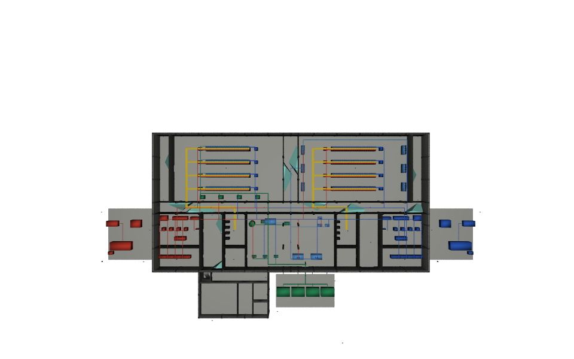
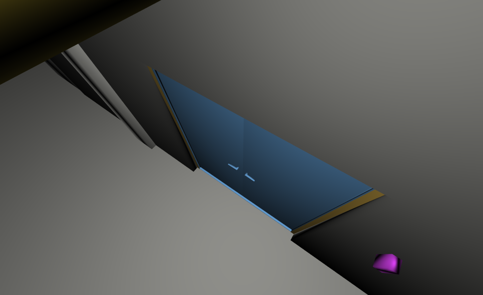

# Coverage on demo-datacentre-01

Inputs: the published **data-centre v0.4.8 base** stage and [named cameras](inputs/cameras.usda). The hook imports quarantined `Pset_AecoCctv` facts, derives native camera/guide data, and evaluates CriticalDoors and Privacy. No generator or converter runs.

Version 0.5.7 keeps this standalone publication unchanged. A suite can call
the hook with `AECO_STUDY_ROOT=/Studies/cctv` and its own cameras beneath
`/Renders/cctv`. The configured layout uses `Looks`, `Targets` and `Studies`
as child names; `/` retains `AecoCctvLooks`, `SecurityTargets` and
`SecurityStudies`. [Integration contract and tests](../../docs/study-root.md).

Open the committed [result/example.usdc](result/example.usdc) with stock USD; no family plugins or sibling checkouts are needed:

```sh
usdview examples/datacentre/result/example.usdc
```

The flattened stage includes the composed geometry, study results and presentation. [result/layers/](result/layers/) preserves the example's own editable USDA opinions; camera derivations are split into six files to stay below 2 MB per layer. The complete result is capped at 10 MB. [result/vanilla.png](result/vanilla.png) is independently rendered with stock USD and `proxy,render` purposes, so guide shells remain available in the stage but are absent from that image. The two study renders below include guides.

Use the root [environment recipe](../../README.md#build-and-check), then:

```sh
env -u PYTHONPATH PYTHONPATH="$AECO_CORE_ROOT" "$AECO_PYTHON" examples/datacentre/run.py
env -u PYTHONPATH PYTHONPATH="$AECO_CORE_ROOT" "$AECO_PYTHON" examples/datacentre/run.py --publish
```

Ordinary runs write `out/` only. Publishing updates `result/`, `renders/` and [manifest.json](manifest.json); the [expected findings](expected/findings.json) are never overwritten automatically. `AECO_DATACENTRE_ROOT` selects the pinned release. An explicit `AECO_DATACENTRE_STAGE` compatibility probe is labelled `override` and does not establish pinned acceptance. During regeneration, `out/source-data` links to that published source directory so archived composition wrappers contain no checkout locations; source files are excluded from the archived layers. Open the flattened crate as the standalone entry point. The example uses a fixed study receipt time (`2026-09-11T00:00:00Z`) for reproducible archived layers; normal CLI studies retain the actual run time.

The imported census is 45 cameras / 45 sensors / three types / seven presets / zero unmatched. The eleven door targets use 250 px/m, plane density and dori2015. Coverage counts and privacy exclusion hits are read from the result records. See [release acceptance](../../docs/migration.md) for measured totals and sampling limits.





Render purposes include guide, proxy and render. Light teal shows the eleven CriticalDoors shells clipped by study obstacles; cyan denotes nominal driver-only sectors, hidden wherever a study shell exists. Privacy writes 49 shells retained for inspection but hidden in this overview. Extent volumes, density shells, envelopes and roof slabs are also hidden. The look-through alone hides all guides and its own device geometry, and uses the study's frustum with a blue door, gold frame and purple reader.

The displayed shell union inside the L00 hall footprints is **0.1533 m²**, versus **723.4732 m²** for the same sensors' nominal sectors (1 cm scanline estimate). Coverage remains **11/11** doors and **0** privacy hits. See the [method and limitations](../../docs/usecase.md#6-the-example-on-the-demo-data-centre).

Both images must have ≥20% foreground, ≤40% saturated white, non-uniform pixels and satisfy the family size caps. `expected/findings.json` stores those numeric limits; `out/render-metrics.json` and the manifest store actual measurements. Publishing fails if a render violates a limit. Presentation opinions leave study inputs and the published facility unchanged. The geometry does not establish lighting, compression or recognition performance.

The pinned runner refreshes the ignored `inputs/source` symlink from
`AECO_DATACENTRE_ROOT`. Archived `result/layers/out/source.usda` refers through
`../../../inputs/source/dist/base/dc.usda`; run the example to recreate the
alias after relocating the checkout. S29 checks the reference without following
the link. The standalone `result/example.usdc` needs no source checkout.

Version 0.5.6 updates public dependency pins and the source-tag notice. This fixture explicitly replays
its 0.5.3 import, derivation and study provenance (including the fixed receipt time),
so the existing opinions and hashes remain comparable across layouts. Ordinary
CLI operations use the current version. The rebuilt crate and all fifteen editable
layers match v0.5.5 byte for byte. Fresh renders pass; the committed images are
retained because renderer sampling changes PNG bytes. The gate regenerates and compares
canonical crate contents, all authored layer bytes, findings and valid renders.
