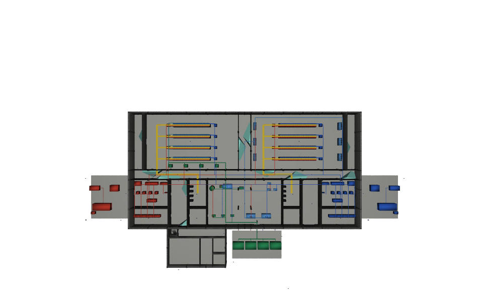

# Camera coverage

CCTV adds camera drivers and sampled coverage studies to existing core elements. Open the [minimal lobby stage](../examples/minimal.usda), then follow the [data-centre workflow](../../docs/usecase.md) for the published example and its limitations.

Nine applied APIs and 71 properties keep the released stage vocabulary. Camera optics and geometry are derived into separate layers; plugin-free tools see ordinary Camera and Mesh prims. The Python validator plugin reports static driver defects and stale, missing or failing study results.
